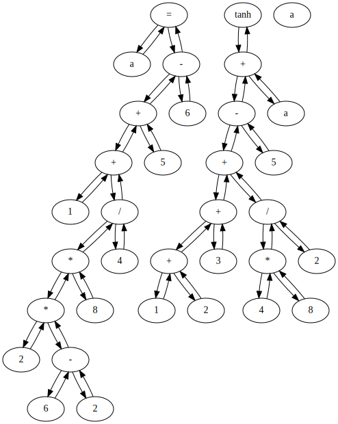

# interactive-calculator

这是一个基于用java实现的自定义字节码的交互式计算器。这是一个自学项目，如果你正在学习编译原理，这个项目非常适合你！

## 介绍

- 交互式计算器是具有加号、减号、乘号和减号等基本功能的计算器。此外，该计算器还支持一些有用的数学函数：tanh、tan、sin、cos、cot。
- 这个计算器最重要的功能是支持变量，您可以在其中定义变量，定义后使用它。
- 你还可以在计算器中使用系统命令

## 下载和使用

```bash
git clone https://github.com/Chang-LeHung/interactive-calculator.git
cd interactive-calculator/
java -jar target/calculator-1.0-SNAPSHOT.jar execturo.Terminal
```

### 基础计算

```bash
$java -jar target/calculator-1.0-SNAPSHOT.jar executor.Terminal
>1+2;
ICInt{val=3}
>2+5-1+6
ICInt{val=12}
>2*(1+2)-5
ICInt{val=1}
```

### 执行系统命令

```bash
>pwd
/home/$HOME/interactive-calculator
>ls
dependency-reduced-pom.xml
pom.xml
README.md
src
target
>echo hello world
hello world
```

### 变量和函数的使用

```bash
>a=1
>b=2
>c=3
>d=1+2+3+4+5*7-(2-3)*6
>a
ICInt{val=1}
>d
ICInt{val=51}
>tan(a+b)
ICDouble{val=-0.1425465430742778}
>sin(d)
ICDouble{val=0.6702291758433747}
>cos(d)
ICDouble{val=0.7421541968137826}
>cot(d)
ICDouble{val=1.1073140704146487}
```

### 序列化抽象语法树

```bash
>a=1+2*(6-2)*8/4+5-6;
>tanh(1+2+3+4*8/2 - 5  + a);
ICDouble{val=1.0}
>a
ICDouble{val=16.0}
>dump
digraph AST {
    1[label="="];
    2[label="a"];
    3[label="-"];
    4[label="+"];
    5[label="+"];
    6[label="1"];
    7[label="/"];
    8[label="*"];
    9[label="*"];
    10[label="2"];
    11[label="-"];
    12[label="6"];
    13[label="2"];
    14[label="8"];
    15[label="4"];
    16[label="5"];
    17[label="6"];
    18[label="tanh"];
    19[label="+"];
    20[label="-"];
    21[label="+"];
    22[label="+"];
    23[label="+"];
    24[label="1"];
    25[label="2"];
    26[label="3"];
    27[label="/"];
    28[label="*"];
    29[label="4"];
    30[label="8"];
    31[label="2"];
    32[label="5"];
    33[label="a"];
    34[label="a"];

    1->2;
    2->1;
    5->6;
    6->5;
    9->10;
    10->9;
    11->12;
    12->11;
    11->13;
    13->11;
    9->11;
    11->9;
    8->9;
    9->8;
    8->14;
    14->8;
    7->8;
    8->7;
    7->15;
    15->7;
    5->7;
    7->5;
    4->5;
    5->4;
    4->16;
    16->4;
    3->4;
    4->3;
    3->17;
    17->3;
    1->3;
    3->1;
    23->24;
    24->23;
    23->25;
    25->23;
    22->23;
    23->22;
    22->26;
    26->22;
    21->22;
    22->21;
    28->29;
    29->28;
    28->30;
    30->28;
    27->28;
    28->27;
    27->31;
    31->27;
    21->27;
    27->21;
    20->21;
    21->20;
    20->32;
    32->20;
    19->20;
    20->19;
    19->33;
    33->19;
    18->19;
    19->18;

}
>
```

可以使用`graphiz`将上面的输出结果转化成一张抽象语法书的图片或者pdf。

- 创建一个文件 `demo.dot` 并且将下面的内容输入进去。

```
digraph AST {
    1[label="="];
    2[label="a"];
    3[label="-"];
    4[label="+"];
    5[label="+"];
    6[label="1"];
    7[label="/"];
    8[label="*"];
    9[label="*"];
    10[label="2"];
    11[label="-"];
    12[label="6"];
    13[label="2"];
    14[label="8"];
    15[label="4"];
    16[label="5"];
    17[label="6"];
    18[label="tanh"];
    19[label="+"];
    20[label="-"];
    21[label="+"];
    22[label="+"];
    23[label="+"];
    24[label="1"];
    25[label="2"];
    26[label="3"];
    27[label="/"];
    28[label="*"];
    29[label="4"];
    30[label="8"];
    31[label="2"];
    32[label="5"];
    33[label="a"];
    34[label="a"];

    1->2;
    2->1;
    5->6;
    6->5;
    9->10;
    10->9;
    11->12;
    12->11;
    11->13;
    13->11;
    9->11;
    11->9;
    8->9;
    9->8;
    8->14;
    14->8;
    7->8;
    8->7;
    7->15;
    15->7;
    5->7;
    7->5;
    4->5;
    5->4;
    4->16;
    16->4;
    3->4;
    4->3;
    3->17;
    17->3;
    1->3;
    3->1;
    23->24;
    24->23;
    23->25;
    25->23;
    22->23;
    23->22;
    22->26;
    26->22;
    21->22;
    22->21;
    28->29;
    29->28;
    28->30;
    30->28;
    27->28;
    28->27;
    27->31;
    31->27;
    21->27;
    27->21;
    20->21;
    21->20;
    20->32;
    32->20;
    19->20;
    20->19;
    19->33;
    33->19;
    18->19;
    19->18;

}
```

- 生成pdf

```bash
dot -Tpdf demo.dot -odemo.pdf
```

- 生成sag

```bash
dot -Tsvg demo.dot -odemo.svg
```

- 生成的抽象语法树




